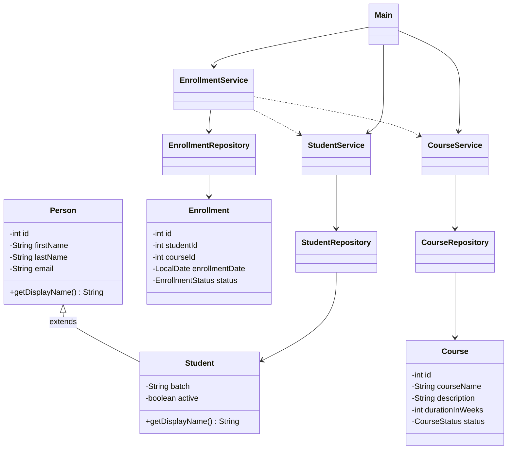

# LearnTrack — Student & Course Management System (Core Java)

LearnTrack is a console-based Student & Course Management System built with Core Java. An admin can manage students, courses, and enrollments through a menu-driven interface. All data is held in memory using `ArrayList`s.

## Features

- **Student Management:** add, view all, search by ID, deactivate (soft-delete).
- **Course Management:** add, view all, activate/deactivate.
- **Enrollment Management:** enroll a student in a course, view a student's enrollments, mark an enrollment completed or cancelled.

## Concepts Demonstrated

- Encapsulation (private fields + getters/setters)
- Inheritance (`Student extends Person`) and `super(...)`
- Polymorphism (overridden `getDisplayName()`)
- Constructor overloading (Student with / without email) and method overloading (`addStudent`)
- Static members for unique ID generation (`IdGenerator`)
- Collections (`ArrayList`) for in-memory storage
- Custom exceptions and try-catch for graceful error handling
- Layered design: entity / repository / service / UI

## Project Structure

```
src/com/airtribe/learntrack/
├── Main.java                 # Menu & application entry point
├── entity/                   # Person, Student, Course, Enrollment
├── repository/               # In-memory ArrayList storage
├── service/                  # Business logic
├── exception/                # EntityNotFoundException, InvalidInputException
├── util/                     # IdGenerator, InputValidator
├── constants/                # AppConstants, MenuOptions
└── enums/                    # CourseStatus, EnrollmentStatus
docs/                         # Setup_Instructions, JVM_Basics, Design_Notes
```

## How to Compile and Run

### IntelliJ IDEA (recommended)
1. Open the `LearnTrack` folder.
2. Mark `src` as Sources Root if needed.
3. Open `Main.java` → click the green ▶ → **Run 'Main.main()'**.

### Terminal

**Windows (PowerShell):**
```powershell
javac -d out (Get-ChildItem -Recurse src -Filter *.java).FullName
java -cp out com.learntrack.Main
```

**macOS / Linux:**
```bash
find src -name "*.java" > sources.txt
javac -d out @sources.txt
java -cp out com.learntrack.Main
```

## Class Diagram



## Author

Om Agarwal